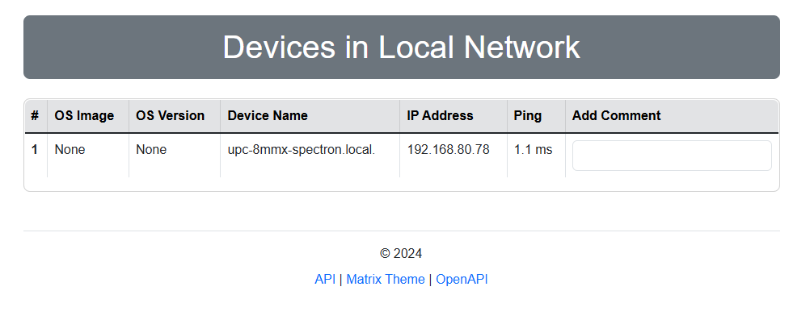

# Avahi-Web

Is a web-based interface to discover and view devices in local area network. Avahi is a system which facilitates service discovery on a local network via the mDNS/DNS-SD protocol suite.

## Yocto Recipe
The `yocto` folder contains the Yocto recipe for avahi service configuration on a embeded linux device.

## Systemd service
Systemd service `avahi-web.service` is a service to run web interface on server.

